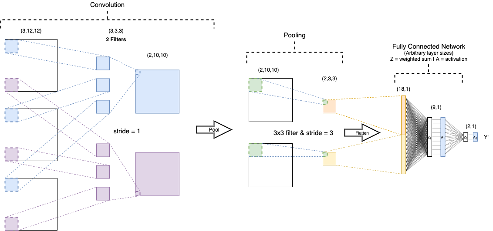

# CNN From Scratch

> **Status**: Draft (resolve all TODOs)

This 'CNN From Scratch' is a simple CNN framework that has been coded using only NumPy for matrix mathematics. This project was done to explore, in detail, how Convolutional Neural Networks work.

This README doc will serve as a starting point for anyone who is looking to understand CNNs in more scratch; in particular, people who are interested in coding a similar framework to the one in this repo.

## Table of Contents
- [CNN From Scratch](#cnn-from-scratch)
	- [Table of Contents](#table-of-contents)
- [Intro to CNNs](#intro-to-cnns)
- [Convolutional Layer](#convolutional-layer)
	- [Conv2D Layer Object](#conv2d-layer-object)
		- [Hyper-parameters:](#hyper-parameters)
		- [Back-propagation](#back-propagation)
- [Pooling Layer](#pooling-layer)
- [Fully Connected Layer](#fully-connected-layer)
- [Loss/ Cost](#loss-cost)
- [Optimisers](#optimisers)
- [The Model Object](#the-model-object)
- [Useful References](#useful-references)

# Intro to CNNs

A Convolutional Neural Networks (CNN) is a deep learning algorithm that combines a fully connected neural network with convolutional and pooling layers that results in a spacially more efficent algorithm (less parameters than a fully connected neural network), often with improved performance. CNNs were developed by the computer vision community and are often used with images - though they can, in theory, be used for other types of input, including sequences.

CNNs exhibite spacial-invariance - meaning they can often do much better than standard NNs when identifying features that are not confined to a specific region of the image. Imagine, aiming to recognise that an image contains a cat, regardless of where the cat is in the image. This kind of problem is more difficult for a fully connected neural network to learn.

The diagram below shows an example forwards flow of a CNN. All matrices are represented to scale and the shapes stated are correct based on the specified filter shapes, strides and pooling.



The architecture of a CNN is somewhat down to the developer and optimum choices can vary between use cases. However, they all start with some combination of 'Convolutional' and 'Pooling' layers and then end with a small number (usually) of fully connected layers.

# Convolutional Layer

In the convolutional layer, a number of filters (aka kernels/ masks) are systematically slid over the input image, from top left to bottom right. At each step, the values of the filter are multiplied by the overlapped values of the input and summed together. These resultant scalars, also known as 'weighted sums', are added together with the corresponding weighted sums from the other channels and placed into the output matrix in the respective position. Each filter has the same number of channels as the input image and the layer output has equal numbers of channels as there are filters.

> [TODO: Illustration of convolution process.]

This process can be implemented by the following function. Here 'A' is a single channel of the input image and 'B' is the corresponding channel of one of the filters. The 'stride' value represents the size of each step taken as the filter traverses over the input. *This function is implemented in the Conv2D layer in the cnn.layers subpackage.*

<details>
	<summary>Code for convolution...</summary>

``` python
def convolve(A, B, stride,full_convolve=False):
	""" A and B are 2D arrays. Array B will be convolved over Array A using the stride provided.
		- 'full_convolve' is where the bottom right cell of B starts over the top of the top left cell of A and shifts by stride until the top left cell of B is over the bottom right cell of A. (i.e. A is padded in each dimension by B - 1 in the respective dimension). """
	assert A.ndim == 2
	assert B.ndim == 2
	if full_convolve:
		vertical_pad = B.shape[0] - 1
		horizontal_pad = B.shape[1] - 1
		A = np.pad(A,[(vertical_pad,vertical_pad),(horizontal_pad,horizontal_pad)],'constant')
	arows, acols = A.shape
	brows, bcols = B.shape

	rout = int((arows - brows) / stride) + 1
	cout = int((acols - bcols) / stride) + 1

	output = np.zeros(shape=(rout,cout))

	# start with mask in top left corner
	curr_y = out_y = 0	# 'curr_y' is y position of the top left corner of filt on top of '_input'. 'out_y' is the corresponding y position in the output array.
	while curr_y <= arows - brows:
		curr_x = out_x = 0	# 'curr_x' is x position of the top left corner of filt on top of '_input'. 'out_x' is the corresponding x position in the output array.
		while curr_x <= acols - bcols:
			output[out_y,out_x] += np.sum( A[ curr_y : curr_y + brows, curr_x : curr_x + bcols ] * B)
			curr_x += stride
			out_x += 1

		curr_y += stride
		out_y += 1

	return output
```

</details>

The above described function, while intuitive based on theory, is not efficient and can quite adversely affect runtime speeds. To combat this, certain abstractions can be made which still result in the same outputs.

<details>
	<summary>Vectorised implementation...</summary>

The main change for this implementation is due to the fact that it turns out that the sub matrices involved in each weighted sum can be pre-extracted from the input matrix and a dot product performed with a transformed filters matrix (including all filters at once).

> [TODO: Illustration of matrix transformations]

``` python
def convolve_vectorised(X,K, stride, full_convolve=False):
	"""
	X: 4D array of shape: (batch_size,channels,rows,cols)
	K: 4D array of shape: (num_filters,X_channels,rows,cols)

	Speed of this function is inversely proportional to [X_rows - K_rows] * [X_cols - K_cols].
	- Therefore, the larger the difference between size of X compared with K, the longer the function takes to run - this is due to the nested loop.
	"""
	assert X.ndim == 4 and K.ndim == 4, 'X and K should be 4D arrays.'
	assert X.shape[1] == K.shape[1], f'Both X and K should have the same number of channels. X has {X.shape[1]} and K has {K.shape[1]}.'
	X = X.copy()
	K = K.copy()

	if full_convolve:
		vertical_pad = K.shape[2] - 1
		horizontal_pad = K.shape[3] - 1
		X = np.pad(X,[(0,0),(0,0),(vertical_pad,vertical_pad),(horizontal_pad,horizontal_pad)],'constant',constant_values=0)

	# Flatten last 2 dimensions of K so that it becomes a 3D array with shape (num filts, K_rows * K_cols * X channels)
	Kflat = np.transpose(K,axes=(0,1,3,2)).reshape((K.shape[0],np.prod(K.shape[1:])))

	# Extract each slice of X for the conv operation and place into columns of Xsliced
	fmap_rows = int((X.shape[2] - K.shape[2]) / stride) + 1
	fmap_cols = int((X.shape[3] - K.shape[3]) / stride) + 1
	Xsliced = np.zeros((X.shape[0],np.prod(K.shape[1:]),fmap_rows*fmap_cols))
	col_index = 0
	for vstart in range(0,X.shape[2] - K.shape[2] + 1,stride):
		for hstart in range(0,X.shape[3] - K.shape[3] + 1,stride):	# NOTE: This double for loop can become slow when X inner shape is significantly greater than K inner shape (rows,cols)
			Xsliced[:,:,col_index] = np.transpose(X[:,:,vstart:vstart+K.shape[2],hstart:hstart+K.shape[3]],axes=(0,1,3,2)).reshape((X.shape[0],np.prod(K.shape[1:])))
			col_index += 1
	Fmap_flat = np.matmul(Kflat, Xsliced)	# (batch size, num filts, fmap_rows * fmap_cols)
	# Transform Fmap_flat to (batch size, num filts, fmap_rows, fmap_cols)
	return Fmap_flat.reshape((X.shape[0],K.shape[0], fmap_rows,fmap_cols))
```

</details>

## Conv2D Layer Object

The Conv2D object represents a single convolutional layer that can work with 2-dimensional convolutions. **This does not mean the input data can only be 2D**, there is a notable difference between performing 2D convolutions vs 3D convolutions. 3D convolutions are not covered here.

This layer expects a 4-dimensional input matrix containing multiple 3D arrays; shape: (m,ch,r,c) - here, m is batch size, ch is number of channels, r is number of rows and c is number of columns.

### Hyper-parameters:

- **Number of filters**: More filters allows more variation in features that are detected.
- **Filter shape** (rows,cols): Typically 3x3 or 5x5. Smaller filters will maintain higher granularity of the data.
- **Stride**: The size of the step taken when shifting the filter over the input. 
- **Padding**: Influences the change in size between input and output. Value can typically be provided as an integer (applied to both dimensions), a tuple (pad_row, pad_col) or by specifying the name of a 'pad type' e.g. 'same' (output size is same as input) or 'valid' (no padding applied - default). Padding can also ensure that more attention is paid to the data at the edges of the image.

... less vital hyper-param as will usually just be left as 'kaiming'/ 'he' normal.
- **Initiation method**: The method used for initialising the filter values. Check out [this link](https://towardsdatascience.com/weight-initialization-in-neural-networks-a-journey-from-the-basics-to-kaiming-954fb9b47c79) if you are interested in more info on this.

Other implmentations could include more hyper-params, those stated here are really just the key hyper-params.

### Back-propagation

The aim of back-propagation is to get the cost gradient with respect to (w.r.t.): filters  (dCdF), biases (dCdB) and the input to this layer (dCdX).

To calculate these cost gradients, the dilated cost gradient (w.r.t. layer output) and the number of pixels exluded in the forwards pass need to be obtained. 

> TODO: continue... 

**dC/dF**:

Cost gradient with respect to the filters turns out to be a convolution operation between the (padded) input - trimmed by any pixels that were excluded in the forwards propagation - and the dilated cost gradient, using a stride of 1.

# Pooling Layer


# Fully Connected Layer


# Loss/ Cost


# Optimisers


# The Model Object


# Useful References

 - [TowardsDataScience - Convolutional Neural Networks from the ground up](https://towardsdatascience.com/convolutional-neural-networks-from-the-ground-up-c67bb41454e1)

 - [TowardsDataScience - Applied Deep Learning](https://towardsdatascience.com/applied-deep-learning-part-4-convolutional-neural-networks-584bc134c1e2)

 - [Convolutional Networks](https://cs231n.github.io/convolutional-networks/)

 - [MNIST database](http://yann.lecun.com/exdb/mnist/)

 - [SuperDataScience - The Ultimate Guide to Convolutional Neural Networks (CNN)](https://www.superdatascience.com/blogs/the-ultimate-guide-to-convolutional-neural-networks-cnn)
 
 - [Convolutions and Backpropagations](https://medium.com/@pavisj/convolutions-and-backpropagations-46026a8f5d2c)
 
 - [3Blue1Brown Backpropagation calculus](https://www.youtube.com/watch?v=tIeHLnjs5U8)

- [ML Cheatsheet](https://ml-cheatsheet.readthedocs.io)

- [Medium - Backpropagation for Convolution with Strides [> 1, w.r.t. inputs]](https://medium.com/@mayank.utexas/backpropagation-for-convolution-with-strides-8137e4fc2710)

- [Medium - Backpropagation for Convolution with Strides [> 1, w.r.t. filters]](https://medium.com/@mayank.utexas/backpropagation-for-convolution-with-strides-fb2f2efc4faa)

- [On Vectorization of Deep Convolutional Neural Networks for Vision Tasks](http://lxu.me/mypapers/vcnn_aaai15.pdf)

