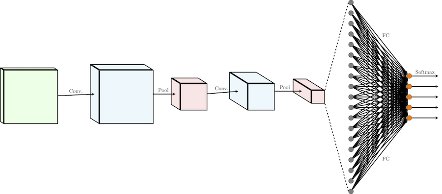
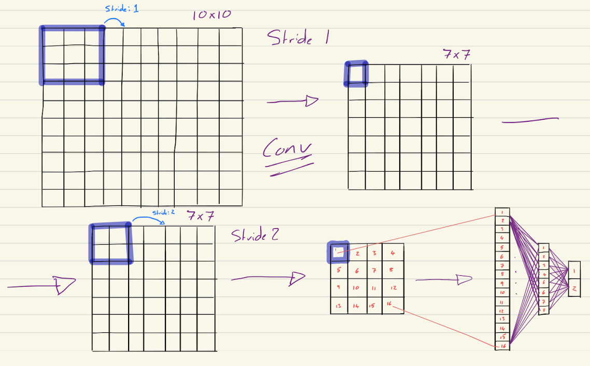

# CNN From Scratch

I am writing a Convolutional Neural Network Programme using only core Python packages. The idea behind this is that if I can build the model step by step, I will grow to understand how it works from the ground up. CNNs, being the most complicated ML algorithms should mean that once I have completed this I can understand all the other algorithms as well.

## Diagram

This diagram below shows a high level view of the structure of a Convolutional Neural Network.

Below is a quick sketch I made to help illustrate the flow through a CNN. The sketch depicts a simple input of shape 10x10 with a single convolutional layer using a filter of shape 3x3 and stride = 1. Then there is a pooling layer with a filter of shape 2x2 and stride 2 followed by a single fully connected layer before the binary output.

## Useful References

 - [TowardsDataScience - Convolutional Neural Networks from the ground up](https://towardsdatascience.com/convolutional-neural-networks-from-the-ground-up-c67bb41454e1)

 - [TowardsDataScience - Applied Deep Learning](https://towardsdatascience.com/applied-deep-learning-part-4-convolutional-neural-networks-584bc134c1e2)

 - [Convolutional Networks](https://cs231n.github.io/convolutional-networks/)

 - [MNIST database](http://yann.lecun.com/exdb/mnist/)

 - [SuperDataScience - The Ultimate Guide to Convolutional Neural Networks (CNN)](https://www.superdatascience.com/blogs/the-ultimate-guide-to-convolutional-neural-networks-cnn)
 
 - [Convolutions and Backpropagations](https://medium.com/@pavisj/convolutions-and-backpropagations-46026a8f5d2c)
 
 - [3Blue1Brown Backpropagation calculus](https://www.youtube.com/watch?v=tIeHLnjs5U8)
