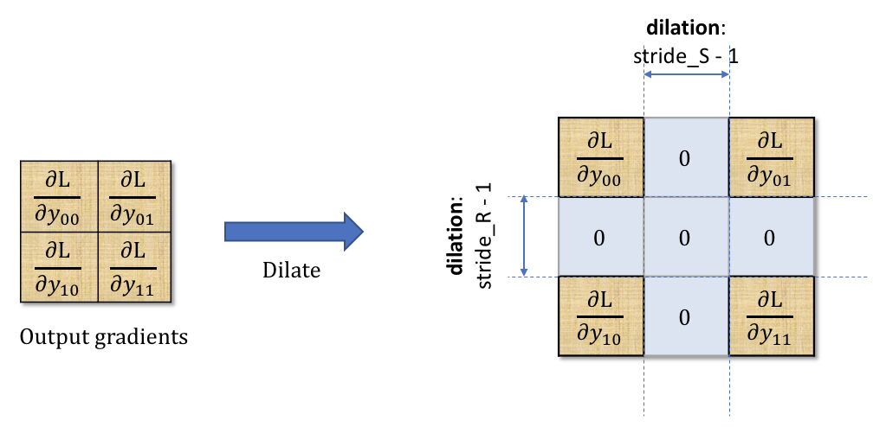
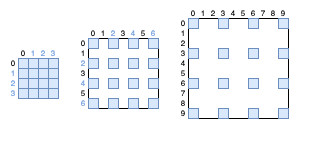
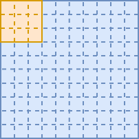

# CNN From Scratch

> **Status**: Draft (resolve all TODOs)

This 'CNN From Scratch' is a simple CNN framework that has been coded using only NumPy for matrix mathematics. This project was done to explore, in detail, how Convolutional Neural Networks work.

This README doc will serve as a starting point for anyone who is looking to understand CNNs in more scratch; in particular, people who are interested in coding a similar framework to the one in this repo.

## Table of Contents
- [CNN From Scratch](#cnn-from-scratch)
	- [Table of Contents](#table-of-contents)
- [Intro to CNNs](#intro-to-cnns)
- [Convolutional Layer](#convolutional-layer)
	- [Forwards Propagation Implmentation](#forwards-propagation-implmentation)
	- [Backwards Propagation Implementation](#backwards-propagation-implementation)
		- [Dilated dC/dO](#dilated-dcdo)
		- [Excluded pixels](#excluded-pixels)
	- [Conv2D Layer Object](#conv2d-layer-object)
		- [Hyper-parameters:](#hyper-parameters)
- [Pooling Layer](#pooling-layer)
	- [Forwards Propagation Implmentation](#forwards-propagation-implmentation-1)
	- [Backwards Propagation Implemtation](#backwards-propagation-implemtation)
	- [Pool Layer Object](#pool-layer-object)
- [Fully Connected Layer](#fully-connected-layer)
- [Loss/ Cost](#loss-cost)
- [Optimisers](#optimisers)
- [The Model Object](#the-model-object)
- [Useful References](#useful-references)

# Intro to CNNs

A Convolutional Neural Networks (CNN) is a deep learning algorithm that combines a fully connected neural network with convolutional and pooling layers that results in a spacially more efficent algorithm (less parameters than a fully connected neural network), often with improved performance. CNNs were developed by the computer vision community and are often used with images - though they can, in theory, be used for other types of input, including sequences.

CNNs exhibite spacial-invariance - meaning they can often do much better than standard NNs when identifying features that are not confined to a specific region of the image. Imagine, aiming to recognise that an image contains a cat, regardless of where the cat is in the image. This kind of problem is more difficult for a fully connected neural network to learn.

The diagram below shows an example forwards flow of a CNN. All matrices are represented to scale and the shapes stated are correct based on the specified filter shapes, strides and pooling.


The architecture of a CNN is somewhat down to the developer and optimum choices can vary between use cases. However, they all start with some combination of 'Convolutional' and 'Pooling' layers and then end with a small number (usually) of fully connected layers.

# Convolutional Layer

In the convolutional layer, a number of filters (aka kernels/ masks) are systematically slid over the input image, from top left to bottom right. At each step, the values of the filter are multiplied by the overlapped values of the input and summed together. These resultant scalars, also known as 'weighted sums', are added together with the corresponding weighted sums from the other channels and placed into the output matrix in the respective position. Each filter has the same number of channels as the input image and the layer output has equal numbers of channels as there are filters.

> [TODO: Illustration of convolution process.]

## Forwards Propagation Implmentation

The convolutional forwards propagation process described above can be implemented by the following function. Here 'A' is a single channel of the input image and 'B' is the corresponding channel of one of the filters. The 'stride' value represents the size of each step taken as the filter traverses over the input. *This function is implemented in the Conv2D layer in the cnn.layers subpackage.*

<details>
	<summary>Code for convolution...</summary>

``` python
def convolve(A, B, stride,full_convolve=False):
	""" A and B are 2D arrays. Array B will be convolved over Array A using the stride provided.
		- 'full_convolve' is where the bottom right cell of B starts over the top of the top left cell of A and shifts by stride until the top left cell of B is over the bottom right cell of A. (i.e. A is padded in each dimension by B - 1 in the respective dimension). """
	assert A.ndim == 2
	assert B.ndim == 2
	if full_convolve:
		vertical_pad = B.shape[0] - 1
		horizontal_pad = B.shape[1] - 1
		A = np.pad(A,[(vertical_pad,vertical_pad),(horizontal_pad,horizontal_pad)],'constant')
	arows, acols = A.shape
	brows, bcols = B.shape

	rout = int((arows - brows) / stride) + 1
	cout = int((acols - bcols) / stride) + 1

	output = np.zeros(shape=(rout,cout))

	# start with mask in top left corner
	curr_y = out_y = 0	# 'curr_y' is y position of the top left corner of filt on top of '_input'. 'out_y' is the corresponding y position in the output array.
	while curr_y <= arows - brows:
		curr_x = out_x = 0	# 'curr_x' is x position of the top left corner of filt on top of '_input'. 'out_x' is the corresponding x position in the output array.
		while curr_x <= acols - bcols:
			output[out_y,out_x] += np.sum( A[ curr_y : curr_y + brows, curr_x : curr_x + bcols ] * B)
			curr_x += stride
			out_x += 1

		curr_y += stride
		out_y += 1

	return output
```

</details>

<br>

The above described function, while intuitive based on theory, is not efficient and can quite adversely affect runtime speeds. To combat this, certain abstractions can be made which still result in the same outputs.

<details>
	<summary>Vectorised implementation...</summary>

The main change for this implementation is due to the fact that it turns out that the sub matrices involved in each weighted sum can be pre-extracted from the input matrix and a dot product performed with a transformed filters matrix (including all filters at once).

> [TODO: Illustration of matrix transformations]

``` python
def convolve_vectorised(X,K, stride, full_convolve=False):
	"""
	X: 4D array of shape: (batch_size,channels,rows,cols)
	K: 4D array of shape: (num_filters,X_channels,rows,cols)

	Speed of this function is inversely proportional to [X_rows - K_rows] * [X_cols - K_cols].
	- Therefore, the larger the difference between size of X compared with K, the longer the function takes to run - this is due to the nested loop.
	"""
	assert X.ndim == 4 and K.ndim == 4, 'X and K should be 4D arrays.'
	assert X.shape[1] == K.shape[1], f'Both X and K should have the same number of channels. X has {X.shape[1]} and K has {K.shape[1]}.'
	X = X.copy()
	K = K.copy()

	if full_convolve:
		vertical_pad = K.shape[2] - 1
		horizontal_pad = K.shape[3] - 1
		X = np.pad(X,[(0,0),(0,0),(vertical_pad,vertical_pad),(horizontal_pad,horizontal_pad)],'constant',constant_values=0)

	# Flatten last 2 dimensions of K so that it becomes a 3D array with shape (num filts, K_rows * K_cols * X channels)
	Kflat = np.transpose(K,axes=(0,1,3,2)).reshape((K.shape[0],np.prod(K.shape[1:])))

	# Extract each slice of X for the conv operation and place into columns of Xsliced
	fmap_rows = int((X.shape[2] - K.shape[2]) / stride) + 1
	fmap_cols = int((X.shape[3] - K.shape[3]) / stride) + 1
	Xsliced = np.zeros((X.shape[0],np.prod(K.shape[1:]),fmap_rows*fmap_cols))
	col_index = 0
	for vstart in range(0,X.shape[2] - K.shape[2] + 1,stride):
		for hstart in range(0,X.shape[3] - K.shape[3] + 1,stride):	# NOTE: This double for loop can become slow when X inner shape is significantly greater than K inner shape (rows,cols)
			Xsliced[:,:,col_index] = np.transpose(X[:,:,vstart:vstart+K.shape[2],hstart:hstart+K.shape[3]],axes=(0,1,3,2)).reshape((X.shape[0],np.prod(K.shape[1:])))
			col_index += 1
	Fmap_flat = np.matmul(Kflat, Xsliced)	# (batch size, num filts, fmap_rows * fmap_cols)
	# Transform Fmap_flat to (batch size, num filts, fmap_rows, fmap_cols)
	return Fmap_flat.reshape((X.shape[0],K.shape[0], fmap_rows,fmap_cols))
```

</details>

<br>

## Backwards Propagation Implementation

Here we take the cost gradient with respect to (w.r.t.) this layer output (dC/dO) and propagate it backwards through the layer to aquire the cost gradient w.r.t.: filters (dC/dF), biases (dC/dB) and the input to this layer (dC/dX).

To calculate these cost gradients, the **dilated cost gradient** (w.r.t. layer output) and the number of **pixels exluded** in the forwards pass need to be obtained. 

### Dilated dC/dO

Dilating the cost gradient means inserting S - 1 zeros between each of the rows and columns ('S' being the stride size in the given dimension). This is illustrated very well in [this Medium blog from Mayank](https://medium.com/@mayank.utexas/backpropagation-for-convolution-with-strides-fb2f2efc4faa):



*Here, 'dL/dy' corresponds to the more generic cost gradient with respect to layer output (dC/dO in my notation).*

This then yeilds the 'dC/dO_dilated' matrix which contains all the values from the original dC/dO matrix separated by some number of 0s.

<details>
<summary>Expand for code implmentation...</summary>

If stride = 1 then dCdO_dilated is equal to dCdO; 1 - 1 = 0 rows/ cols of zeros inserted.

Otherwise, iteratively insert 0s at the position of each data point, excluding postion (0,0). The code snippet below shows how this can be implmented (at the time of writing this I was unable to find a way to insert all the zeros in one go, hence the loop). The np.insert function inserts a value at the indices specified and thus shifts the value in the matrix at that point to the right or down.

```python
dilation_idx_row = np.arange(c_rows-1) + 1	# Intiatial indices for insertion of zeros
dilation_idx_col = np.arange(c_cols-1) + 1	# Intiatial indices for insertion of zeros
if self.STRIDE == 1:
	dCdO_dilated = dCdO.copy()
else:
	dCdO_dilated = dCdO.copy()
	for n in range(1,self.STRIDE):	# the n multiplier is to increment the indices in the manner required.
		dCdO_dilated = np.insert(
			np.insert( dCdO_dilated, dilation_idx_row * n, 0, axis=2 ),
			dilation_idx_col * n, 0, axis=3)
```

E.g. if the stride on the forwards pass was 3 (S = 3), then the below transformation would be performed, resulting in 2 rows and cols of 0s inserted between each data point. Note, the indices in blue are the positions at which a zero is inserted at each step.



This opertation is valid for a stride size (> 0). The for-loop used will not tend to affect performance much due to the size values usually being fairly small.

</details>

<br>

### Excluded pixels

A convolution operation using a stride of greater than 1 can lead to some pixels being excluded (shown in red below). The animation below illustrates a convolution operation between an input (10x10) and a filter (3x3) using a stride of 2 - this results in the last column and row being excluded from the output feature map.



This therefore means that the 'effective' input is smaller than the actual input, which needs to be accounted for when calculating the cost gradients within this layer. The number of excluded pixels in each dimension can be calculated using the following equation:

> 					pxls = (X - F) % S

**Calculating dC/dF**:

As derived in this [Medium post by Mayank](https://medium.com/@mayank.utexas/backpropagation-for-convolution-with-strides-fb2f2efc4faa), it turns out the cost gradient with respect to the filters is a convolution operation between the (padded) input (trimmed by any pixels that were excluded in the forwards propagation) and the dilated cost gradient, using a stride of 1. The code below shows how this is implemented in the "cnn" framework, for a single example (i) from the batch. This will be summed over all the examples in the batch (i: 0 -> m-1).

```python
dCdF[filt_index, channel_index] += Conv2D.convolve( self.padded_input[i,channel_index, :self.padded_input.shape[2] - pxls_excl_y, :self.padded_input.shape[3] - pxls_excl_x], dCdO_dilated[i,filt_index], stride=1 )
```

**Calculating dC/dX**:

When calculating dC/dX, it is important to understand the impact of any padding that may have been applied. We can easily calculate the cost gradient w.r.t. the padded input that was used in the forwards convolution operation, then from this, we can obtain the cost gradient w.r.t. the raw layer input 'X'.

Again, as shown by [Mayank](https://medium.com/@mayank.utexas/backpropagation-for-convolution-with-strides-8137e4fc2710), dC/dX is calculated using a convolution. This time it is a 'full convolution' between dC/dO_dilated and the filters rotated by 180 degrees along the last two axis (rows rotating to columns) with a stride of 1. "Full convolution" means padding the first matrix by the size of the second matrix - 1, in the respective dimensions. This has the effect of starting the second matrix with its bottom right 'cell' over the first matrix's top left 'cell'.

> [TODO: Diagram to demonstrate full convolution]

```python
dCdX_pad[i,channel_index, :dCdX_pad.shape[2] - pxls_excl_y, :dCdX_pad.shape[3] - pxls_excl_x] += Conv2D.convolve( dCdO_dilated[i,filt_index], rotated_filters[filt_index,channel_index], stride=1, full_convolve=True )
```

Here dCdX_pad is cost gradient w.r.t. the padded input. This array is sliced to account for the potentially different shapes of full-convolution output and dCdX_pad if pxls_excl_x and pxls_excl_y are non-zero. If they are zero, however, the whole matrix will be selected and the operation will still work.

I have to credit [Pavithra Solai](https://medium.com/@pavisj/convolutions-and-backpropagations-46026a8f5d2c) for giving a very useful introduction to the backpropagation process of convolutional layers. It was through reading this blog that I first started to understand how to implment the convolution backpropagation. The calculation Pavithra shows is slightly different to what I have described here because their example uses a stride of 1 and no padding whereas, the operation as I describe is the general case that will work for all configurations.

<br>

## Conv2D Layer Object

The Conv2D object represents a single convolutional layer that can work with 2-dimensional convolutions. **This does not mean the input data can only be 2D**, there is a notable difference between performing 2D convolutions vs 3D convolutions. 3D convolutions are not covered here.

This layer expects a 4-dimensional input matrix containing multiple 3D arrays; shape: (m,ch,r,c) - here, m is batch size, ch is number of channels, r is number of rows and c is number of columns.

### Hyper-parameters:

- **Number of filters**: More filters allows more variation in features that are detected.
- **Filter shape** (rows,cols): Typically 3x3 or 5x5. Smaller filters will maintain higher granularity of the data.
- **Stride**: The size of the step taken when shifting the filter over the input. 
- **Padding**: Influences the change in size between input and output. Value can typically be provided as an integer (applied to both dimensions), a tuple (pad_row, pad_col) or by specifying the name of a 'pad type' e.g. 'same' (output size is same as input) or 'valid' (no padding applied - default). Padding can also ensure that more attention is paid to the data at the edges of the image.

... less vital hyper-param as will usually just be left as 'kaiming'/ 'he' normal.
- **Initiation method**: The method used for initialising the filter values. Check out [this link](https://towardsdatascience.com/weight-initialization-in-neural-networks-a-journey-from-the-basics-to-kaiming-954fb9b47c79) if you are interested in more info on this.

Other implmentations could include more hyper-params, those stated here are really just the key hyper-params.

<br>

# Pooling Layer

The main function of the pooling layer is to reduce the dimensionality of the data by removing unwanted noise. The most common type of pooling is 'Max Pooling' which takes the largest value in each region - focussing on the strongest signal.

The process is implemented in a similar way to the convolutions except the filters do not contain any weights and there are no weighted sums. Instead the filters are used to define the focus region for each step and then one of several operations is performed on the sub-array. Typically the 3 main operation choices here are 'max', 'mean', 'min' - these are all implemented in the cnn framework.

## Forwards Propagation Implmentation

The filter is 'shifted' over the input image. At each step, either the max, mean or min of the values in scope is taken and placed in the corresponding position of the output array. The below diagram shows an example max pooling operation of a matrix (6x6) with a 2x2 filter and a stride of 2.


The code block below shows how the pooling operation can be implmented.

<details>

<summary>Pooling code</summary>

```python
# Shift Filter Window over the image and perform the downsampling
curr_y = out_y = 0
while curr_y <= pad_rows - self.FILT_SHAPE[0]:
	curr_x = out_x = 0
	while curr_x <= pad_cols - self.FILT_SHAPE[1]:
		for channel_index in range(channels):
			if self.POOL_TYPE == 'max':
				sub_arr = self.padded_input[i, channel_index, curr_y : curr_y + self.FILT_SHAPE[0], curr_x : curr_x+ self.FILT_SHAPE[1] ]
				self.output[i,channel_index, out_y, out_x] = np.max( sub_arr )
			elif self.POOL_TYPE == 'min':
				sub_arr = self.padded_input[i, channel_index, curr_y : curr_y + self.FILT_SHAPE[0], curr_x : curr_x+ self.FILT_SHAPE[1] ]
				self.output[i,channel_index, out_y, out_x] = np.min( sub_arr )
			elif self.POOL_TYPE == 'mean':
				sub_arr = self.padded_input[i, channel_index, curr_y : curr_y + self.FILT_SHAPE[0], curr_x : curr_x + self.FILT_SHAPE[1] ]
				self.output[i,channel_index, out_y, out_x] = np.mean( sub_arr )

		curr_x += self.STRIDE
		out_x += 1
	curr_y += self.STRIDE
	out_y += 1
```

</details>

## Backwards Propagation Implemtation


## Pool Layer Object


# Fully Connected Layer


# Loss/ Cost


# Optimisers


# The Model Object


# Useful References

 - [TowardsDataScience - Convolutional Neural Networks from the ground up](https://towardsdatascience.com/convolutional-neural-networks-from-the-ground-up-c67bb41454e1)

 - [TowardsDataScience - Applied Deep Learning](https://towardsdatascience.com/applied-deep-learning-part-4-convolutional-neural-networks-584bc134c1e2)

 - [Convolutional Networks](https://cs231n.github.io/convolutional-networks/)

 - [MNIST database](http://yann.lecun.com/exdb/mnist/)

 - [SuperDataScience - The Ultimate Guide to Convolutional Neural Networks (CNN)](https://www.superdatascience.com/blogs/the-ultimate-guide-to-convolutional-neural-networks-cnn)
 
 - [Convolutions and Backpropagations](https://medium.com/@pavisj/convolutions-and-backpropagations-46026a8f5d2c)
 
 - [3Blue1Brown Backpropagation calculus](https://www.youtube.com/watch?v=tIeHLnjs5U8)

- [ML Cheatsheet](https://ml-cheatsheet.readthedocs.io)

- [Medium - Backpropagation for Convolution with Strides [> 1, w.r.t. inputs]](https://medium.com/@mayank.utexas/backpropagation-for-convolution-with-strides-8137e4fc2710)

- [Medium - Backpropagation for Convolution with Strides [> 1, w.r.t. filters]](https://medium.com/@mayank.utexas/backpropagation-for-convolution-with-strides-fb2f2efc4faa)

- [On Vectorization of Deep Convolutional Neural Networks for Vision Tasks](http://lxu.me/mypapers/vcnn_aaai15.pdf)

